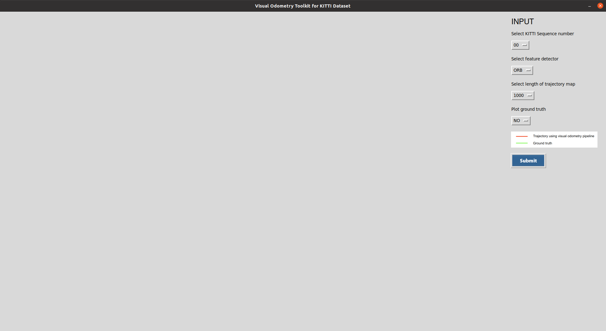
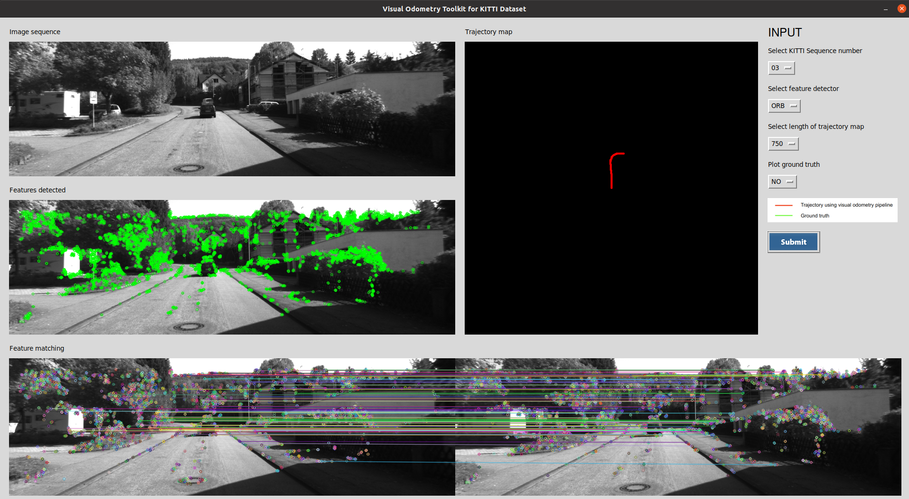
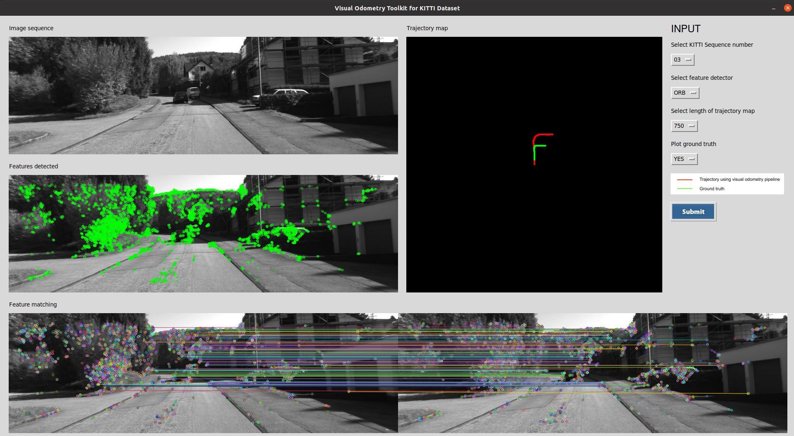

# Visual Odometry Toolkit for KITTI dataset

A simple toolkit for visual odometry visualization, tailored for KITTI dataset.

### KITTI Dataset 

The KITTI Vision Benchmark Suite comprises of stereo visual odometry sequences of 39.2 km length and it is one of the most widely used dataset by researchers working in the domain of Visual odometry and SLAM. The odometry benchmark consists of 22 stereo sequences, saved in loss less png format. Initial 11 sequences (00-10) also have ground truth trajectories and the remaining 11 sequences (11-21) dont have ground truth for evaluation.

Download the dataset from https://www.cvlibs.net/datasets/kitti/eval_odometry.php and place it appropriately according to the directory structure below.

### Directory structure

visual_odometry_toolkit.py\
pose_evaluation_utils.py\
README.md\
requirements.txt\
Dataset\
&emsp;&emsp;+-- KITTI\
&emsp;&emsp;&emsp;&emsp;+-- poses\
&emsp;&emsp;&emsp;&emsp;&emsp;&emsp;+-- 00.txt\
&emsp;&emsp;&emsp;&emsp;&emsp;&emsp;+-- 01.txt\
&emsp;&emsp;&emsp;&emsp;&emsp;&emsp;&emsp;&emsp; ...\
&emsp;&emsp;&emsp;&emsp;&emsp;&emsp;+-- 10.txt\
&emsp;&emsp;&emsp;&emsp;+-- sequences\
&emsp;&emsp;&emsp;&emsp;&emsp;&emsp;+-- 00\
&emsp;&emsp;&emsp;&emsp;&emsp;&emsp;&emsp;&emsp;+--image_0\
&emsp;&emsp;&emsp;&emsp;&emsp;&emsp;&emsp;&emsp;&emsp;&emsp;+--000000.png\
&emsp;&emsp;&emsp;&emsp;&emsp;&emsp;&emsp;&emsp;&emsp;&emsp;+--000001.png\
&emsp;&emsp;&emsp;&emsp;&emsp;&emsp;&emsp;&emsp;&emsp;&emsp;&emsp;...\
&emsp;&emsp;&emsp;&emsp;&emsp;&emsp;&emsp;&emsp;+--image_1\
&emsp;&emsp;&emsp;&emsp;&emsp;&emsp;&emsp;&emsp;+--calib.txt\
&emsp;&emsp;&emsp;&emsp;&emsp;&emsp;&emsp;&emsp;+--times.txt\
&emsp;&emsp;&emsp;&emsp;&emsp;&emsp;+-- 01\
&emsp;&emsp;&emsp;&emsp;&emsp;&emsp;&emsp; ...\
&emsp;&emsp;&emsp;&emsp;&emsp;&emsp;+-- 21\
icons\
&emsp;&emsp;+-- color-code.png\
&emsp;&emsp;+-- submit-button.png

### Environment

Python 3.8.10

##### Libraries/ Packages used

numpy 1.23.4\
opencv-python 4.6.0.66\
Pillow 9.3.0

### Run command

`python visual_odometry_toolkit.py`

### Screenshots

